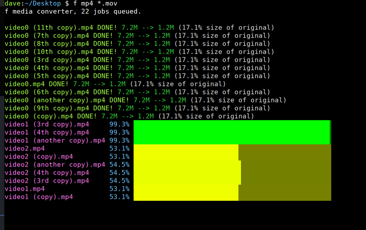

# f

## 1. what the *f* is that name
f stands for ffmpeg. i wanted a very short alias for converting media with ffmpeg. so why not
call it f.

## 2. what does it do
it converts media files using presets defined in [`presets.ts`](./src/presets.ts).

cli usage is `f [presets] [files]`, but the ordering doesn't matter.
- `f mp4 test1.mov test2.mov` (preset first)
- `f test1.mov test2.mov mp4` (preset last)

you can do multiple things at once, just keep the order of preset and files the same.
- `f mp3 test1.mov mp4 test2.mov` (preset first)
- `f test1.mov mp3 test2.mov mp4` (preset last)

also, it looks like this

## 3. how do i add presets
modify source and recompile

## 4. development tutorial and breakdown
setup
- run `npm i -D`
- run `tsc` or `npm run build` to build
- run `tsc -w` or `npm start` to watch build
- run `npm link` to get development version of f in your path
- run `node dist/cli` to run f, or `f` if you linked it
files
- **src/cli.ts** - the cli for parsing the args you pass on the command line
- **src/presets.ts** - the presets with args for ffmpeg
- **src/job-runner.ts** - the thing that runs ffmpeg and parses its output
- **src/render.ts** - thing that outputs the progress bars
- **src/index.ts** - an api combining all the stuff if you import the node module as a node module. why
